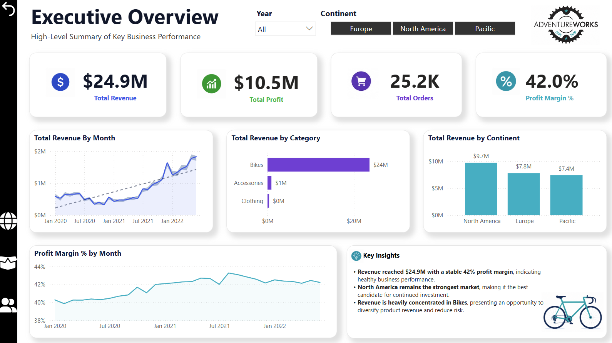
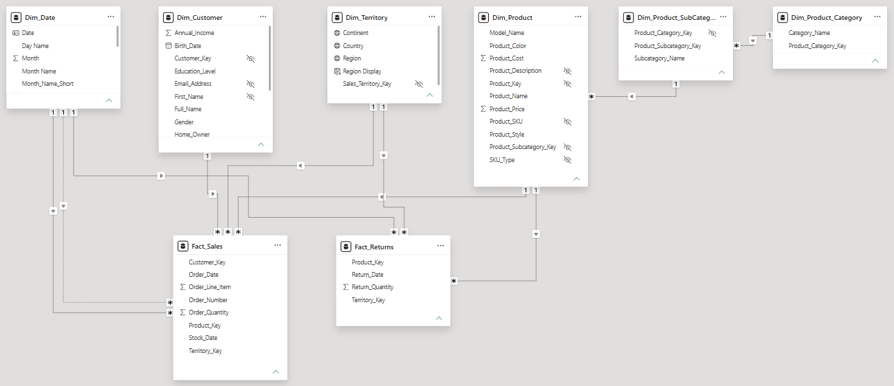

# AdventureWorks-PowerBI-Dashboard
Interactive Power BI dashboard analyzing AdventureWorks sales, products, and customer performance.



## 📖 Project Overview

This project is an end-to-end business intelligence solution built in Power BI using the AdventureWorks dataset. 
It transforms sales data into interactive dashboards that help monitor sales performance, product trends, and customer behavior. 
The report combines data modeling, DAX calculations, and data visualization to support business decision-making.

## 🎯 Business Background

<details>
<summary><strong>1. Company Overview</strong></summary>

<br>

AdventureWorks Cycles is a fictional multinational bicycle manufacturer and retailer that sells bicycles, cycling accessories, and apparel across North America, Europe, and the Pacific region.

The company collects sales data, customer information, product details, and return records. As the business grows, management needs a more effective way to monitor performance and make strategic decisions.

</details>

<br>

<details>
<summary><strong>2. Business Context</strong></summary>

<br>

AdventureWorks has experienced steady business growth over recent years. However, business data is stored across multiple operational datasets, making it difficult for decision-makers to obtain a clear and consistent view of company performance.
    
Different departments often answer business questions manually using spreadsheets or isolated reports, resulting in slower decision-making and limited visibility into overall business performance.
    
To support future growth, AdventureWorks wants to build a centralized Business Intelligence solution that provides executives and business managers with interactive reporting and actionable insights.

</details>

<br>

<details>
<summary><strong>3. Business Problem</strong></summary>

<br>

AdventureWorks lacks a centralized reporting system that allows leadership to understand how sales, profitability, customer behavior, and product performance contribute to overall business success.
    
Without integrated reporting, management struggles to answer critical business questions such as:
    
- Which products generate the most value?
- Which customer segments contribute the highest revenue?
- Which regions should receive additional investment?
- Which products have unusually high return rates?
- What trends require management attention?
    
As a result, strategic decisions are slower and often rely on fragmented information rather than a single, trusted source of data.

</details>

<br>

<details>
<summary><strong>4. Business Goals</strong></summary>

<br>

The Business Intelligence solution should help AdventureWorks achieve the following objectives.

**Primary Goal:**

Provide executives with a centralized dashboard that supports faster, data-driven business decisions.

**Supporting Goals:**

- Monitor revenue, profit, and order performance over time.
- Identify the products and categories driving business growth.
- Understand customer purchasing behavior and high-value segments.
- Compare regional performance to identify growth opportunities.
- Monitor product returns to uncover potential quality or operational issues.
- Improve visibility across the organization using a single source of truth.

</details>

## 🛠 Project Workflow

<details>
<summary><strong>1. Business Understanding</strong></summary>

#### Stakeholder Analysis

The first step of the project was to identify the key stakeholders and understand how the dashboard would support their business decisions. This helped ensure the reporting solution addressed both strategic and operational requirements.

| Stakeholder | Business Need | Decisions Supported |
|-------------|---------------|---------------------|
| **Executive Leadership** | Monitor overall business performance and strategic KPIs | Strategic planning, business growth, and investment priorities |
| **Sales Managers** | Track sales performance across products, regions, and time | Sales target setting, product focus, and promotional planning |
| **Product Managers** | Evaluate product performance and return trends | Pricing strategy, product improvements, and inventory planning |
| **Regional Managers** | Compare sales performance across territories | Regional investment decisions and resource allocation |
| **Marketing Managers** | Analyze customer behavior and product trends | Marketing campaigns, customer targeting, and promotional strategies |

>**Outcome:** The dashboard was designed to provide each stakeholder group with relevant KPIs and interactive visualizations, enabling faster and more informed business decisions.

#### Overall Business Strategy

AdventureWorks' business strategy focuses on driving sustainable growth through better visibility into sales performance, product performance, customer behavior, and regional trends.

This Business Intelligence solution supports that strategy by providing a centralized reporting platform that enables stakeholders to monitor key performance indicators (KPIs), identify business opportunities, and make informed decisions based on reliable data.

Specifically, this project helps AdventureWorks:

- **Monitor sales performance** to evaluate revenue, profit, and order trends over time.
- **Identify high-performing and underperforming products** to support product portfolio and pricing decisions.
- **Understand customer purchasing behavior** to better target valuable customer segments and improve marketing strategies.
- **Evaluate regional sales performance** to identify growth opportunities and allocate resources more effectively.
- **Analyze product return trends** to identify products that may require further investigation or improvement.
- **Establish a single source of truth** that replaces fragmented reporting with consistent, interactive business insights.

By transforming raw transactional data into actionable information, this solution enables leadership to make faster, more informed decisions that align with the company's growth objectives.

</details>

<br>

<details>
<summary><strong>2. KPI Planning</strong></summary>

<br>

Before building the dashboard, the key performance indicators (KPIs) were defined to ensure the solution aligned with AdventureWorks' business objectives. Each KPI was selected to measure business performance, monitor progress, and support strategic decision-making.

#### Success Criteria

The success of this project was defined by its ability to deliver a centralized business intelligence solution that enables stakeholders to:

- Monitor overall business performance
- Identify growth opportunities
- Track key performance indicators (KPIs)
- Support data-driven decision-making through interactive reporting

#### Key Performance Indicators (KPIs)

| KPI | Business Purpose |
|-----|------------------|
| **Total Revenue** | Measure overall sales performance. |
| **Total Profit** | Evaluate business profitability. |
| **Profit Margin (%)** | Monitor operational efficiency and profitability. |
| **Total Orders** | Track sales activity and customer demand. |
| **Revenue per Customer** | Measure customer value and purchasing behavior. |
| **Revenue by Product** | Identify high-performing and underperforming products. |
| **Revenue by Territory** | Compare regional sales performance and identify growth opportunities. |
| **Return Rate (%)** | Monitor product quality and customer satisfaction. |

#### Data Requirements

To calculate these KPIs, the dashboard integrates data from multiple business domains:

| Business Domain | Data Required |
|-----------------|---------------|
| Sales | Sales transactions, order quantity, revenue |
| Customers | Customer information and purchasing behavior |
| Products | Products, categories, and subcategories |
| Returns | Returned orders and return quantities |
| Territories | Sales territories and regional information |
| Finance | Costs, profit, and pricing information |
| Calendar | Date table for time-based analysis |

#### Data Sources

| Data Source | Business Owner |
|-------------|----------------|
| Sales System | Sales |
| CRM | Sales & Marketing |
| Returns System | Operations |
| Product Database | Product Management |
| Territory Database | Sales Operations |
| Finance System | Finance |

#### KPI Measurement Plan

The selected KPIs provide a balanced view of business performance across four key areas:

- **Sales Performance** – Revenue, Profit, Orders
- **Product Performance** – Product Revenue, Return Rate
- **Customer Performance** – Revenue per Customer
- **Regional Performance** – Revenue by Territory

Together, these metrics provide stakeholders with a comprehensive view of company performance while supporting strategic and operational decision-making.

</details>

<br>

<details>
<summary><strong>3. Data Preparation</strong></summary>

<br>

Before building the data model, the AdventureWorks source data was imported, assessed, and transformed to ensure it was accurate, consistent, and suitable for analysis.

#### Data Acquisition

The project uses the AdventureWorks dataset provided as multiple CSV files, which were imported into **Power BI Desktop** using **Power Query**.

| Source | Access Method | Storage |
|---------|---------------|---------|
| AdventureWorks CSV Files | Power BI Desktop (Power Query) | Local Project Folder |

#### Data Quality Assessment

The source data was reviewed to identify issues that could affect reporting accuracy and model reliability.

**Quality checks performed**

- Reviewed column data types
- Checked for missing values
- Validated unique keys
- Reviewed duplicate records
- Verified consistency across related tables
- Confirmed data integrity before modeling

**Known Data Considerations**

| Issue | Resolution |
|-------|------------|
| **Customer Name Encoding** | A small number of customer names contain corrupted accented characters in the original dataset. Changing the file encoding to **UTF-8 (65001)** did not resolve the issue, indicating the problem exists in the source data. Since it does not affect relationships, KPI calculations, or business analysis, the original values were retained. |
| **Date Range Alignment** | Order_Date from Sales Data begins on **Jan 01 2020**, while Stock_Date begins on **Sep 11 2019**. To ensure complete date coverage across the model, the Date table was created using the earliest available date (**Sep 11 2019**). |

[📷 View Customer Name Issue Screenshot](Images/Issue_Unicode%20(UTF-8).webp)

#### Data Transformation

Power Query was used to prepare the data before modeling.

**Transformations performed**

- Imported and combined source datasets
- Promoted column headers
- Assigned appropriate data types
- Removed unnecessary columns
- Renamed fields for consistency
- Prepared dimension tables for modeling

#### Data Validation

The transformed data was validated before proceeding to data modeling.

**Validation activities**

- Confirmed row counts after transformations
- Verified relationships between datasets
- Checked for unexpected null values
- Reviewed calculated fields
- Ensured the dataset was ready for reporting

</details>

<br>

<details>
<summary><strong>4. Data Modeling</strong></summary>

<br>

After data preparation, a data model was designed to support sales, returns, customer, product, territory, and time-based analysis. The model was optimized for efficient filtering, reusable calculations, and scalable reporting.
The model uses a **hybrid dimensional structure**:

- A star schema design connects the main fact tables to the customer, territory, date, and product dimensions.
- The product hierarchy is normalized into separate product, subcategory, and category tables, creating a snowflake structure.

#### Model Structure

| Table Group | Purpose |
|-------------|---------|
| **Fact_Sales** | Stores sales transactions, including orders, quantities, products, customers, territories, order dates, and stock dates. |
| **Fact_Returns** | Stores product return quantities by return date, product, and territory. |
| **Dim_Customer** | Provides customer attributes for segmentation and behavioral analysis. |
| **Dim_Territory** | Supports regional and geographic performance analysis. |
| **Dim_Date** | Enables consistent time-based analysis across sales and returns. |
| **Product Hierarchy** | Uses Dim_Product, Dim_Product_SubCategory, and Dim_Product_Category to create a normalized product hierarchy, enabling drill-down analysis from product category to individual products. |

#### Relationship Design

The model primarily uses one-to-many relationships with single-direction filtering to ensure efficient data propagation and minimize ambiguity.

**Design principles**

- Connected dimension tables to fact tables using key fields
- Applied one-to-many relationships
- Used single-direction filtering
- Created separate fact tables for sales and returns
- Normalized the product hierarchy into category, subcategory, and product levels
- Avoided unnecessary many-to-many relationships

#### Date Dimension

A dedicated Date dimension was created to provide a consistent calendar across the model and support time intelligence calculations.

**Key features**

- Supports multiple business dates, including **Order_Date**, **Stock_Date**, and **Return_Date**.
- Uses active and inactive relationships to enable analysis across different business events while maintaining a single reusable calendar.
- Includes Year, Quarter, Month, Week, and Day attributes for flexible time-based reporting.
- Begins on **11 September 2019**, the earliest date in the dataset, ensuring complete coverage for both sales and inventory data.

#### Product Snowflake Structure

The product dimension was separated into three levels:

```text
Dim_Product_Category
        ↓
Dim_Product_SubCategory
        ↓
Dim_Product
        ↓
Fact_Sales / Fact_Returns
```

#### Data Model Diagram



*Figure: Hybrid dimensional model consisting of two fact tables, shared dimensions, and a snowflaked product hierarchy.*


