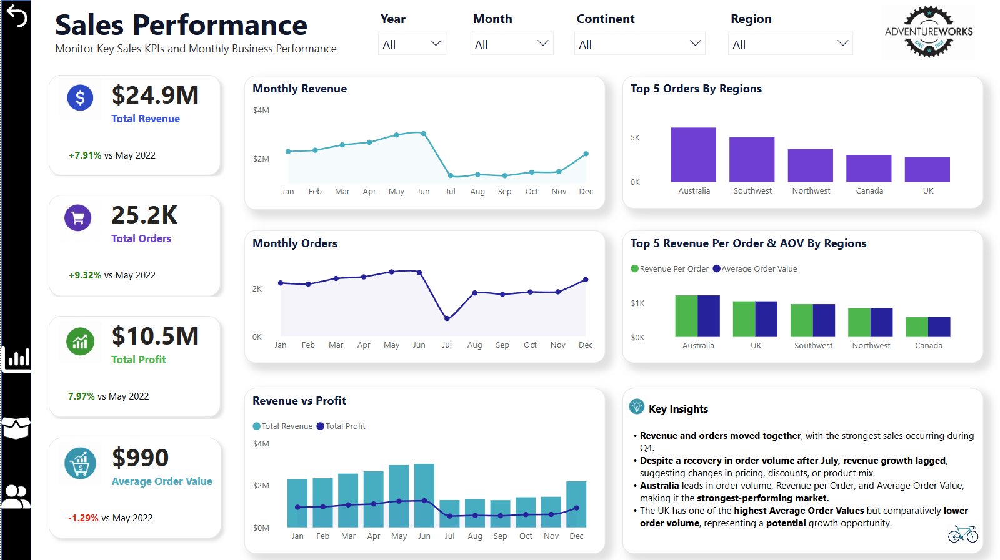
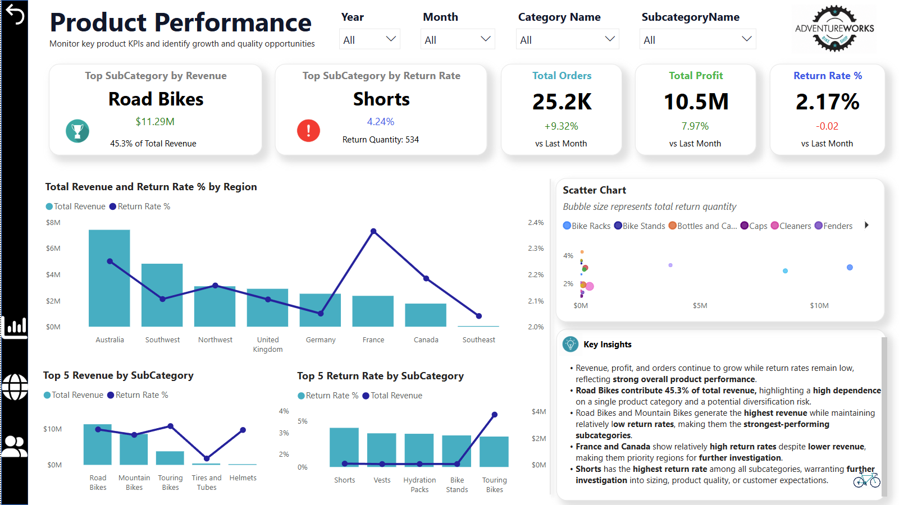
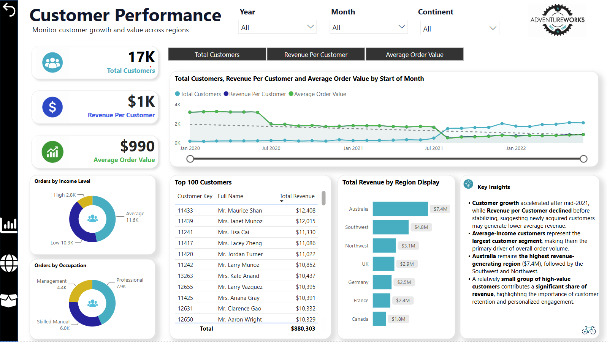

# AdventureWorks-PowerBI-Dashboard
Interactive Power BI dashboard analyzing AdventureWorks sales, products, and customer performance.


#### 🚀 Live Dashboard

#### 👉 **[Click here to view the interactive Power BI Dashboard](https://app.powerbi.com/view?r=eyJrIjoiNzViMDA0YzgtY2JlZi00YTExLWFhM2ItM2U2YTRkOWU0YWM5IiwidCI6ImUzMThjNGEzLTQ4YzYtNGEyYS1iNjg1LTE4Yjc0MDFkYmU5MiJ9)**

## 📖 Project Overview

This project is an end-to-end business intelligence solution built in Power BI using the AdventureWorks dataset from **Data Soursce: Maven Analytics**. 
It transforms sales data into interactive dashboards that help monitor sales performance, product trends, and customer behavior. 
The report combines data modeling, DAX calculations, and data visualization to support business decision-making.

## 🎯 Business Background

<details>
<summary><strong>1. Company Overview</strong></summary>

<br>

AdventureWorks Cycles is a fictional multinational bicycle manufacturer and retailer that sells bicycles, cycling accessories, and apparel across North America, Europe, and the Pacific region.

The company collects sales data, customer information, product details, and return records. As the business grows, management needs a more effective way to monitor performance and make strategic decisions.

</details>

<br>

<details>
<summary><strong>2. Business Context</strong></summary>

<br>

AdventureWorks has experienced steady business growth over recent years. However, business data is stored across multiple operational datasets, making it difficult for decision-makers to obtain a clear and consistent view of company performance.
    
Different departments often answer business questions manually using spreadsheets or isolated reports, resulting in slower decision-making and limited visibility into overall business performance.
    
To support future growth, AdventureWorks wants to build a centralized Business Intelligence solution that provides executives and business managers with interactive reporting and actionable insights.

</details>

<br>

<details>
<summary><strong>3. Business Problem</strong></summary>

<br>

AdventureWorks lacks a centralized reporting system that allows leadership to understand how sales, profitability, customer behavior, and product performance contribute to overall business success.
    
Without integrated reporting, management struggles to answer critical business questions such as:
    
- Which products generate the most value?
- Which customer segments contribute the highest revenue?
- Which regions should receive additional investment?
- Which products have unusually high return rates?
- What trends require management attention?
    
As a result, strategic decisions are slower and often rely on fragmented information rather than a single, trusted source of data.

</details>

<br>

<details>
<summary><strong>4. Business Goals</strong></summary>

<br>

The Business Intelligence solution should help AdventureWorks achieve the following objectives.

**Primary Goal:**

Provide executives with a centralized dashboard that supports faster, data-driven business decisions.

**Supporting Goals:**

- Monitor revenue, profit, and order performance over time.
- Identify the products and categories driving business growth.
- Understand customer purchasing behavior and high-value segments.
- Compare regional performance to identify growth opportunities.
- Monitor product returns to uncover potential quality or operational issues.
- Improve visibility across the organization using a single source of truth.

</details>

## 🛠 Project Workflow

<details>
<summary><strong>1. Business Understanding</strong></summary>

#### Stakeholder Analysis

The first step of the project was to identify the key stakeholders and understand how the dashboard would support their business decisions. This helped ensure the reporting solution addressed both strategic and operational requirements.

| Stakeholder | Business Need | Decisions Supported |
|-------------|---------------|---------------------|
| **Executive Leadership** | Monitor overall business performance and strategic KPIs | Strategic planning, business growth, and investment priorities |
| **Sales Managers** | Track sales performance across products, regions, and time | Sales target setting, product focus, and promotional planning |
| **Product Managers** | Evaluate product performance and return trends | Pricing strategy, product improvements, and inventory planning |
| **Regional Managers** | Compare sales performance across territories | Regional investment decisions and resource allocation |
| **Marketing Managers** | Analyze customer behavior and product trends | Marketing campaigns, customer targeting, and promotional strategies |

>**Outcome:** The dashboard was designed to provide each stakeholder group with relevant KPIs and interactive visualizations, enabling faster and more informed business decisions.

#### Overall Business Strategy

AdventureWorks' business strategy focuses on driving sustainable growth through better visibility into sales performance, product performance, customer behavior, and regional trends.

This Business Intelligence solution supports that strategy by providing a centralized reporting platform that enables stakeholders to monitor key performance indicators (KPIs), identify business opportunities, and make informed decisions based on reliable data.

Specifically, this project helps AdventureWorks:

- **Monitor sales performance** to evaluate revenue, profit, and order trends over time.
- **Identify high-performing and underperforming products** to support product portfolio and pricing decisions.
- **Understand customer purchasing behavior** to better target valuable customer segments and improve marketing strategies.
- **Evaluate regional sales performance** to identify growth opportunities and allocate resources more effectively.
- **Analyze product return trends** to identify products that may require further investigation or improvement.
- **Establish a single source of truth** that replaces fragmented reporting with consistent, interactive business insights.

By transforming raw transactional data into actionable information, this solution enables leadership to make faster, more informed decisions that align with the company's growth objectives.

</details>

<br>

<details>
<summary><strong>2. KPI Planning</strong></summary>

<br>

Before building the dashboard, the key performance indicators (KPIs) were defined to ensure the solution aligned with AdventureWorks' business objectives. Each KPI was selected to measure business performance, monitor progress, and support strategic decision-making.

#### Success Criteria

The success of this project was defined by its ability to deliver a centralized business intelligence solution that enables stakeholders to:

- Monitor overall business performance
- Identify growth opportunities
- Track key performance indicators (KPIs)
- Support data-driven decision-making through interactive reporting

#### Key Performance Indicators (KPIs)

| KPI | Business Purpose |
|-----|------------------|
| **Total Revenue** | Measure overall sales performance. |
| **Total Profit** | Evaluate business profitability. |
| **Profit Margin (%)** | Monitor operational efficiency and profitability. |
| **Total Orders** | Track sales activity and customer demand. |
| **Revenue per Customer** | Measure customer value and purchasing behavior. |
| **Revenue by Product** | Identify high-performing and underperforming products. |
| **Revenue by Territory** | Compare regional sales performance and identify growth opportunities. |
| **Return Rate (%)** | Monitor product quality and customer satisfaction. |

#### Data Requirements

To calculate these KPIs, the dashboard integrates data from multiple business domains:

| Business Domain | Data Required |
|-----------------|---------------|
| Sales | Sales transactions, order quantity, revenue |
| Customers | Customer information and purchasing behavior |
| Products | Products, categories, and subcategories |
| Returns | Returned orders and return quantities |
| Territories | Sales territories and regional information |
| Finance | Costs, profit, and pricing information |
| Calendar | Date table for time-based analysis |

#### Data Sources

| Data Source | Business Owner |
|-------------|----------------|
| Sales System | Sales |
| CRM | Sales & Marketing |
| Returns System | Operations |
| Product Database | Product Management |
| Territory Database | Sales Operations |
| Finance System | Finance |

#### KPI Measurement Plan

The selected KPIs provide a balanced view of business performance across four key areas:

- **Sales Performance** – Revenue, Profit, Orders
- **Product Performance** – Product Revenue, Return Rate
- **Customer Performance** – Revenue per Customer
- **Regional Performance** – Revenue by Territory

Together, these metrics provide stakeholders with a comprehensive view of company performance while supporting strategic and operational decision-making.

</details>

<br>

<details>
<summary><strong>3. Data Preparation</strong></summary>

<br>

Before building the data model, the AdventureWorks source data was imported, assessed, and transformed to ensure it was accurate, consistent, and suitable for analysis.

#### Data Acquisition

The project uses the AdventureWorks dataset provided as multiple CSV files, which were imported into **Power BI Desktop** using **Power Query**.

| Source | Access Method | Storage |
|---------|---------------|---------|
| AdventureWorks CSV Files | Power BI Desktop (Power Query) | Local Project Folder |

#### Data Quality Assessment

The source data was reviewed to identify issues that could affect reporting accuracy and model reliability.

**Quality checks performed**

- Reviewed column data types
- Checked for missing values
- Validated unique keys
- Reviewed duplicate records
- Verified consistency across related tables
- Confirmed data integrity before modeling

**Known Data Considerations**

| Issue | Resolution |
|-------|------------|
| **Customer Name Encoding** | A small number of customer names contain corrupted accented characters in the original dataset. Changing the file encoding to **UTF-8 (65001)** did not resolve the issue, indicating the problem exists in the source data. Since it does not affect relationships, KPI calculations, or business analysis, the original values were retained. |
| **Date Range Alignment** | Order_Date from Sales Data begins on **Jan 01 2020**, while Stock_Date begins on **Sep 11 2019**. To ensure complete date coverage across the model, the Date table was created using the earliest available date (**Sep 11 2019**). |

[📷 View Customer Name Issue Screenshot](Images/Issue_Unicode%20(UTF-8).webp)

#### Data Transformation

Power Query was used to prepare the data before modeling.

**Transformations performed**

- Imported and combined source datasets
- Promoted column headers
- Assigned appropriate data types
- Removed unnecessary columns
- Renamed fields for consistency
- Prepared dimension tables for modeling

#### Data Validation

The transformed data was validated before proceeding to data modeling.

**Validation activities**

- Confirmed row counts after transformations
- Verified relationships between datasets
- Checked for unexpected null values
- Reviewed calculated fields
- Ensured the dataset was ready for reporting

</details>

<br>

<details>
<summary><strong>4. Data Modeling</strong></summary>

<br>

After data preparation, a data model was designed to support sales, returns, customer, product, territory, and time-based analysis. The model was optimized for efficient filtering, reusable calculations, and scalable reporting.
The model uses a **hybrid dimensional structure**:

- A star schema design connects the main fact tables to the customer, territory, date, and product dimensions.
- The product hierarchy is normalized into separate product, subcategory, and category tables, creating a snowflake structure.

#### Model Structure

| Table Group | Purpose |
|-------------|---------|
| **Fact_Sales** | Stores sales transactions, including orders, quantities, products, customers, territories, order dates, and stock dates. |
| **Fact_Returns** | Stores product return quantities by return date, product, and territory. |
| **Dim_Customer** | Provides customer attributes for segmentation and behavioral analysis. |
| **Dim_Territory** | Supports regional and geographic performance analysis. |
| **Dim_Date** | Enables consistent time-based analysis across sales and returns. |
| **Product Hierarchy** | Uses Dim_Product, Dim_Product_SubCategory, and Dim_Product_Category to create a normalized product hierarchy, enabling drill-down analysis from product category to individual products. |

#### Relationship Design

The model primarily uses one-to-many relationships with single-direction filtering to ensure efficient data propagation and minimize ambiguity.

**Design principles**

- Connected dimension tables to fact tables using key fields
- Applied one-to-many relationships
- Used single-direction filtering
- Created separate fact tables for sales and returns
- Normalized the product hierarchy into category, subcategory, and product levels
- Avoided unnecessary many-to-many relationships

#### Date Dimension

A dedicated Date dimension was created to provide a consistent calendar across the model and support time intelligence calculations.

**Key features**

- Supports multiple business dates, including **Order_Date**, **Stock_Date**, and **Return_Date**.
- Uses active and inactive relationships to enable analysis across different business events while maintaining a single reusable calendar.
- Includes Year, Quarter, Month, Week, and Day attributes for flexible time-based reporting.
- Begins on **11 September 2019**, the earliest date in the dataset, ensuring complete coverage for both sales and inventory data.

#### Product Snowflake Structure

The product dimension was separated into three levels:

```text
Dim_Product_Category
        ↓
Dim_Product_SubCategory
        ↓
Dim_Product
        ↓
Fact_Sales / Fact_Returns
```
#### Data Model Diagram


*Figure: Hybrid dimensional model consisting of two fact tables, shared dimensions, and a snowflaked product hierarchy.*

#### DAX Measures

The dashboard includes a collection of reusable DAX measures for KPI calculations, time intelligence, profitability analysis, and customer metrics.

A complete reference of all measures is available here:

📄 **DAX Measures Documentation** - [View PDF](Docs/Adventure_Work_PowerBI_DAX_Documentation.pdf)


</details>

<br>

<details>
<summary><strong>5. Dashboard Development</strong></summary>

<br>

The dashboard was designed to provide stakeholders with a clear and interactive view of business performance. Each report page focuses on a specific business area while maintaining a consistent layout, navigation, and visual style.

#### Dashboard Design Principles

The dashboard was developed with the following design principles:

- Prioritized key KPIs for quick executive review
- Maintained a consistent color palette and layout across all pages
- Used interactive slicers for flexible analysis
- Applied cross-filtering to support detailed exploration
- Minimized visual clutter to improve readability

#### Executive Overview


The Executive Overview serves as the landing page and provides a high-level summary of business performance through key KPIs, trend analysis, and regional insights.

##### Highlights

- Revenue, Profit and Orders and Profit Margin 
- Sales by continent
- Sales by Category
- Monitor overall business performance

#### Sales Performance



The Sales Performance page focuses on revenue trends and sales activity.

##### Highlights

- Revenue, Profit and Orders trend over time
- Sales by region
- Sales target monitoring
- Monthly performance comparison

#### Product Performance



The Product Performance page analyzes product sales and returns to identify strong and weak performers.

##### Highlights

- Product revenue ranking
- Return rate analysis
- Product category performance
- Top and bottom performing products

#### Customer Performance



The Customer Performance page provides insights into customer segmentation.

##### Highlights

- Customer revenue contribution
- Customer segmentation
- Order frequency
- Geographic customer distribution

#### Interactive Features

The dashboard includes several interactive features to enhance user experience:

- Dynamic slicers
- Cross-filtering between visuals
- Interactive tooltips
- KPI cards with conditional formatting

</details>

<br>

<details>
<summary><strong>6. Business Insights & Recommendations</strong></summary>

<br>

The dashboard provides actionable insights into sales performance, product trends, customer segmentation, and regional performance. These findings can help business stakeholders identify opportunities to increase revenue, improve profitability, and optimize decision-making.

### Executive Overview

The Executive Overview provides a high-level assessment of overall business performance by summarizing financial performance, regional contribution, and product revenue distribution.

#### Key Findings

- The business generated **$24.9M in revenue**, **$10.5M in profit**, and maintained a healthy **42% profit margin** across **25.2K orders**.
- Revenue and profit increased steadily throughout the reporting period, indicating sustained business growth rather than isolated sales spikes.
- **North America** remained the strongest-performing market, contributing the highest overall revenue and representing the best opportunity for continued investment.
- Revenue is heavily concentrated in the **Bikes** category, highlighting a strong product line while creating dependence on a single source of revenue.

#### Deeper Analysis

- Revenue increased throughout the reporting period, reflecting continued business growth. However, the **profit margin did not increase at the same pace**.

- During 2022, revenue continued to rise while the profit margin showed a slight downward trend. This indicates that although the business generated higher total profit, each additional dollar of revenue contributed proportionally less profit than before.

- This pattern may suggest increasing operating costs, pricing adjustments, or a shift toward lower-margin products. As a result, revenue growth should be evaluated alongside profit margin to ensure business growth remains both sustainable and profitable.

#### Strategic Recommendations

- Continue investing in **North America** while evaluating whether successful sales strategies can be replicated across Europe and the Pacific.
- Expand marketing and product development efforts for **Accessories** and **Clothing** to reduce dependence on the Bikes category and diversify revenue sources.
- Monitor **profit margin** alongside revenue growth to ensure increasing sales continue to generate sustainable profitability.
- Investigate the factors contributing to declining profit margins in 2022, including product mix, pricing strategy, and operating costs, to protect future earnings.
---
### Sales Performance

The Sales Performance dashboard evaluates revenue trends, order activity, regional performance, and customer purchasing behavior to identify the key drivers of business growth.

#### Key Findings

- Revenue and order volume increased throughout the reporting period, with the strongest sales performance occurring during **Q4**, indicating clear seasonal demand.
- Although order volume recovered after July, revenue growth was comparatively slower, suggesting that higher sales volume did not translate into proportional revenue growth.
- **Australia** consistently led in **order volume**, **Revenue per Order**, and **Average Order Value (AOV)**, making it the strongest-performing market.
- The **UK** recorded one of the highest **Average Order Values** despite relatively lower order volume, highlighting potential opportunities for market expansion.

#### Deeper Analysis

While overall sales performance improved, customer purchasing behavior changed significantly over time.

- Total orders increased substantially from **2.6K (2020)** to **10.7K (2021)** and **11.8K (2022)**.
- During the same period, **Average Order Value (AOV)** declined from approximately **$2,000** in 2020 to **$872** in 2021 and **$776** in 2022.

This suggests that business growth was increasingly driven by **higher transaction volume rather than larger individual purchases**. Customers placed significantly more orders, but spent less per order on average.

Although this strategy successfully increased revenue, the declining AOV may indicate changes in customer purchasing behavior, pricing strategy, promotional activity, or product mix. Further investigation would help identify the primary drivers behind this trend.

#### Strategic Recommendations

- Continue leveraging seasonal demand by strengthening inventory planning and sales initiatives ahead of **Q4**.
- Monitor **Average Order Value** alongside revenue and order growth to ensure sales volume continues to generate sustainable business value.
- Analyze pricing strategy, promotional campaigns, and product mix to better understand the factors contributing to the decline in AOV.
- Develop cross-selling and upselling initiatives to increase the average spend per transaction while maintaining strong order growth.
- Use Australia's successful sales performance as a benchmark to identify best practices that can be adapted for lower-performing regions, particularly markets with high AOV but lower order volume such as the UK.
---
### Product Performance

The Product Performance dashboard evaluates product sales, profitability, and return trends to identify high-performing product categories and opportunities to improve product quality and customer satisfaction.

#### Key Findings

- Revenue, profit, and orders continued to grow while the overall **return rate remained low (2.17%)**, indicating strong overall product performance.
- **Road Bikes** remained the primary revenue driver, contributing **45.3%** of total revenue while maintaining a relatively low return rate. In 2022, **Mountain Bikes** emerged as the top-performing subcategory, indicating a shift in customer demand and a more balanced product portfolio.
- **Australia** and **Southwest** generated the highest product revenue while maintaining relatively moderate return rates, demonstrating strong regional product performance.
- **France** and **Canada** recorded comparatively higher return rates despite lower revenue, making them priority regions for further investigation.
- **Shorts** recorded the highest return rate among all subcategories, warranting further investigation into product quality, sizing, or customer expectations.

#### Deeper Analysis

##### High-Revenue Markets

##### Australia – Largest Revenue Contributor

- Australia is the company's **highest-performing market**, generating approximately **$7.4M** in revenue while maintaining a relatively low return rate compared with its sales volume. This indicates that strong sales performance has not come at the expense of product quality or customer satisfaction.

- Product sales are primarily driven by **Road Bikes**, supported by Mountain Bikes, making these subcategories the foundation of regional growth. Although products such as **Touring Bikes** and **Helmets** exhibit higher return rates relative to their revenue, their overall financial impact remains limited.

- **Business implication**: Australia represents the benchmark market for sustainable growth, where high sales and controlled returns coexist.

##### Southwest – Balanced Growth Market

- Southwest is the **second-largest revenue-generating region**, producing approximately **$4.8M** in revenue while maintaining one of the lowest return rates among major markets.

- Revenue is distributed across both **Road Bikes and Mountain Bikes**, indicating a more balanced product mix than Australia and reducing dependence on a single subcategory. While **Touring Bikes and Helmets** experience relatively higher return rates, they account for only a small share of regional revenue.

- **Business implication**: Southwest demonstrates scalable growth with efficient product performance and provides a strong model for expansion into similar markets.

##### High-Return Markets

##### France – Highest Regional Return Risk

- Although France contributes only moderate revenue, it records the **highest regional return rate (approximately 2.4%)**, making it the region with the greatest return-related risk.

- Most revenue is generated from **Road Bikes and Mountain Bikes**. However **Touring Bikes** combine meaningful revenue with elevated return rates. In addition, lower-volume products such as **Bike Stands** exhibit particularly high return rates, suggesting potential issues with product quality, customer expectations, or fulfillment.

- **Business implication**: Improving product performance in France could significantly reduce return-related costs and improve regional profitability.

##### Canada – Product Optimization Opportunity

- Canada generates lower revenue than Australia and Southwest while maintaining a return rate above several comparable regions.

- Unlike France, Canada's challenge appears to be concentrated within specific products rather than across the entire market. **Shorts** recorded the highest return rate among all product subcategories, while **Helmets, Jerseys, and Bike Stands** also experienced relatively frequent returns despite their limited revenue contribution.

- This suggests that customer dissatisfaction may be concentrated in niche product categories rather than the company's primary revenue drivers.

- **Business implication**: Targeted improvements to high-return products could reduce operational costs without affecting overall sales performance.

#### Strategic Recommendations

- Continue investing in **Australia** and **Southwest** while using their successful product mix and sales strategies as benchmarks for other regions.
- Reduce dependency on **Road Bikes** by expanding sales of other product categories such as Accessories and Clothing.
- Prioritize investigations in **France** and **Canada** to identify the underlying causes of higher product return rates.
- Review sizing, product quality, product descriptions, and customer feedback for **Shorts, Helmets, Bike Stands**, and other frequently returned products.
- Monitor both **return rate** and **return quantity** when evaluating product performance to prioritize improvement initiatives with the greatest financial impact.
---
### Customer Performance

The Customer Performance dashboard analyzes customer growth, purchasing behavior, customer value, and regional distribution to identify opportunities for customer acquisition and retention.

#### Key Findings

- Customer growth accelerated after **mid-2021**, while **Revenue per Customer** declined before stabilizing, indicating that newly acquired customers generated lower average revenue.
- **Average-income customers** represent the largest customer segment, making them the primary driver of overall order volume.
- **Australia** remains the highest revenue-generating region (**$7.4M**), followed by the **Southwest** and **Northwest**, demonstrating strong regional customer performance.
- A relatively small group of **high-value customers** contributes a significant share of total revenue, highlighting the importance of customer retention and personalized engagement.

#### Deeper Analysis

##### Customer Growth & Customer Value

Customer acquisition accelerated significantly after mid-2021, expanding the overall customer base. However, this growth was accompanied by a decline in **Revenue per Customer**, suggesting that business growth was increasingly driven by acquiring more customers rather than increasing the value of each customer. While Revenue per Customer stabilized over time, improving customer lifetime value remains an opportunity for future growth.

##### Customer Segmentation

Customer demographics vary across regions. **North America** and the **Pacific** are primarily composed of **average-income customers**, whereas **Europe** has a larger concentration of **low-income customers**, indicating different customer profiles and purchasing behaviors across markets.

#### Strategic Recommendations

- Develop retention and loyalty programs targeting high-value customers to maximize customer lifetime value.
- Increase Revenue per Customer through cross-selling, upselling, and personalized product recommendations.
- Tailor marketing campaigns to regional customer demographics rather than applying a single global strategy.
- Continue investing in high-performing regions such as **Australia**, while identifying opportunities to expand customer growth in other markets.
- Monitor customer acquisition alongside Revenue per Customer to ensure business growth remains both scalable and profitable.
